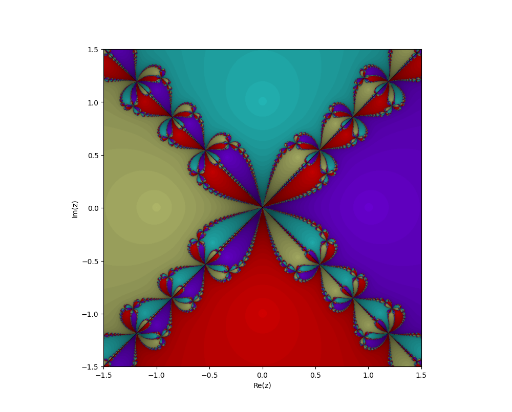
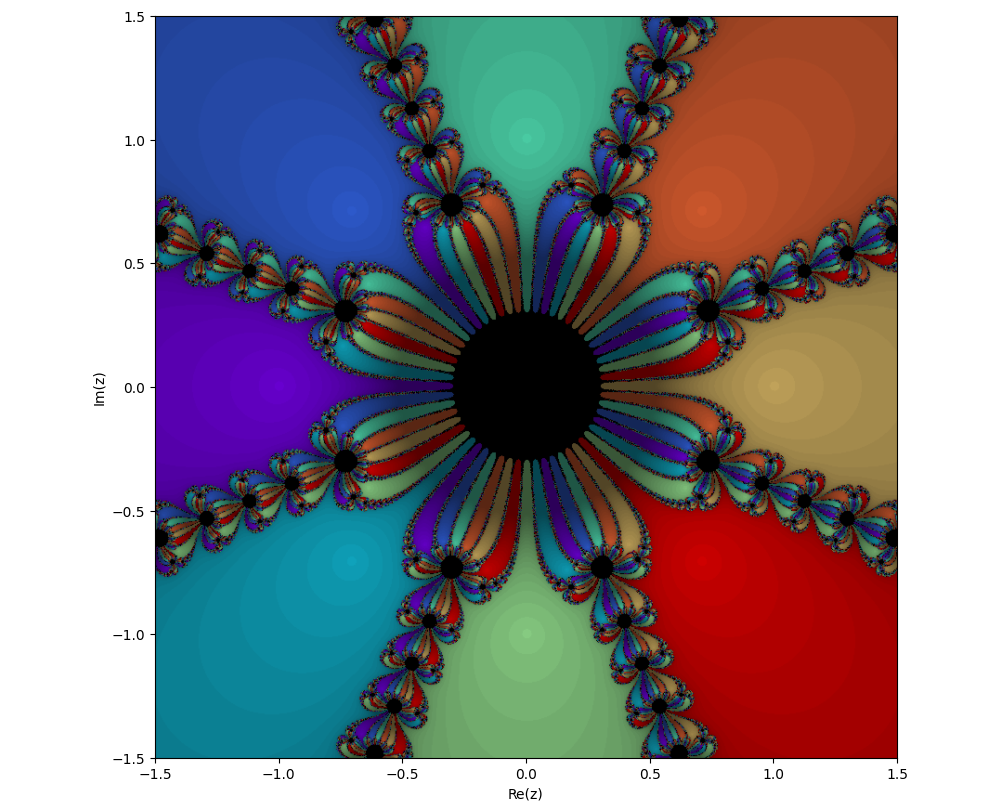

# Newton Fractals & Numerical Methods

A mathematical exploration of root-finding algorithms, polynomial interpolation,
and complex dynamics — culminating in the generation of Newton Fractals.
Built as a research project during 1st Year.

## What is a Newton Fractal?

Newton's method is an iterative algorithm for finding roots of a function.
When applied to polynomials in the **complex plane**, each point either:
- Converges to one of the polynomial's roots, or
- Diverges / oscillates at the boundary

Coloring each point by **which root it converges to** and **how fast**
produces a stunning fractal — the Newton Fractal.

The boundaries between regions of convergence are infinitely complex,
and this is where chaos lives.

---
## Project Structure

```
Newton-Fractals/
├── src/
│   ├── bisection.py        # Bisection Method
│   ├── secant.py           # Secant Method
│   ├── newton.py           # Newton's Method
│   ├── lagrange.py         # Lagrange Interpolation
│   ├── hermite.py          # Cubic Hermite Interpolation
│   └── newton_fractal.py   # Fractal Generator
├── Fractal_z4-1.png
└── README.md
```
## How to Run

```bash
git clone https://github.com/Jaya-student/Newton-Fractals.git
cd Newton-Fractals
pip install numpy matplotlib
python src/newton_fractal.py
```

## Requirements
- Python 3.x
- numpy
- matplotlib

## Results
| Polynomial | Symmetry | Preview |
|---|---|---|
| z³ − 1 | 3-fold |  |
| z⁴ − 1 | 4-fold |  |
| z⁸ − 1 | 8-fold |  |

## Research Paper
This project is accompanied by a full research paper covering the mathematical
derivations. [View Paper](#) ← link your PDF here

## Author
Jaya Patel — IIT Delhi, Mathematics and Computing (1st Year)
